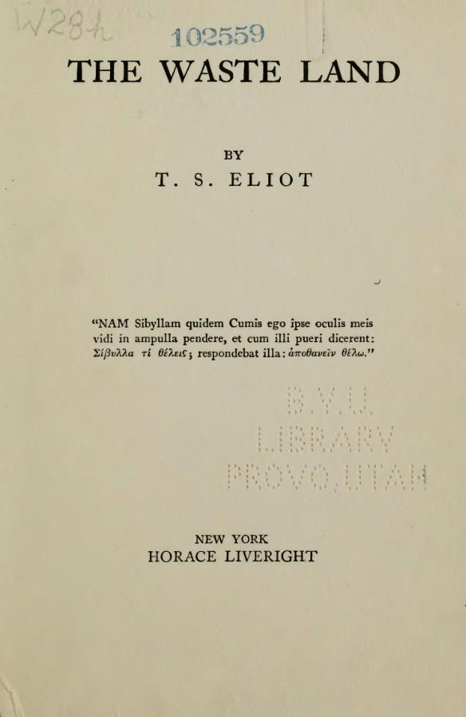

# wasteland!

 

## پیش از حل مساله

متن ورودی به صورت یک فایل با پسوند `txt` در اختیار شما قرار گرفته است.

* شما **مجاز نیستید** هیچ تغییری در متن فایل  و یا نام و پسوند آن اعمال کنید.

* نام فایل ورودی (متن شعر) `wasteland.txt` است

* نام فایل کد پایتون (راه حل نهایی) را `main.py` قرار دهید

* هر دو فایل ورودی و راه حل را در یک مسیر/دایرکتوری/پوشه/فولدر به اسم `wasteland` قرار دهید

* جواب نهایی شما نباید شامل خروجی‌های اضافی‌ای باشد که در مساله هیچ اشاره‌ای به آن نشده. پس اگر مایلید در حین حل مساله برای مشاهده تغییرات، و ... از تابع های `print()` و یا `input()` استفاده کنید. اما در جواب نهایی این قسمت‌های  را پاک کنید. 

* برای ارسال جواب نهایی،‌ فایل کد خودتان را و یا آدرس آخرین کامیتی که منجر به حل مساله شده است را در زیر همین issuse به صورت کامنت اضافه کنید.

* در کنار هرسوال امتیاز آن نوشته شده است


# سوالات 

## سوال  ۱. `2p`
فایل خروجی با اسم `out_words_count.txt`  ایجاد کنید که تعداد کل کلمات شعر wasteland و تعداد کلمات بدون احتساب تکرارشان را در دو خط مجزا بنویسد

**خروجی نمونه**

```
2300
1200
```

## سوال  ۲. `2p`

تابعی با اسم `word_frequency` بنویسید که در ورودی یک رشته `str` دریافت می‌کند و در در خروجی یک دیکشنری بر‌می‌گرداند که کلیدهای آن کلمات یکتای متن و مقدار هر کلید برابر با تعداد تکرار آن کلمه در متن باشد. 

```python
def word_frequncy(text):
    # کد را کامل کنید
    # 
```

## سوال  ۳. `3p`

۱۰ کلمه پرتکرار در متن را پیدا کنید. نتیجه این قسمت از تکلیف باید 
* در فایلی به اسم `out_most_frequent.txt` ذخیره شود، 
* به ترتیب نزولی مرتب شود
*‌  دو کاراکتر اول هر خط برای شماره ردیف خواهد بود 

**خروجی نمونه**
 
```
 1. word1         120
 2. word2         100
 3. word8          70
 ...
 9. word9          31
10. word10          6
```

## سوال  ۴. `1p`

> (با استفاده از قسمت دوم سوال)
 از لحاظ تعداد کاراکتر استفاده شده در کلمه، یک دیکشنری بسازید که حاوی 5
 کلمه‌ طولانی‌تر متن باشد. مقدار هر کلید تعداد دفعات تکرار آن‌ها در متن خواهد بود

## سوال  ۵. `3p`

تمام کلمات Capital این متن را در فایل `out_capital_words.txt` بنویسید. هر خط از فایل خروجی باید شامل یک کلمه و در مقابل آن و بین پرانتز تعداد کل تکرار آن کلمه در متن نوشته شود 

**خروجی نمونه**

```
Serendipity (10)
John (20)
```


## سوال ۶. ‍`4p`

این متن از چند جمله تشکیل شده است؟

نام فایل خروجی  `out_sentences_count.txt` و تنها حاوی یک عدد `int` خواهد بود

## سوال  ۷.‍‍ `6p`

. تمام نقل قول‌های این متن را در فایل `out_quote.txt` ذخیره کنید. هر نقل قول در یک خط مجزا قرار می‌گیرد

## سوال  ۸. `10p`

کلمات خاص مانند اسامی، روزهای هفته، نام شهرها، شاخص ها (مانند Ms.، Mr.) به صورت Capital نوشته می‌شوند‌. از طرفی هر کلمه در ابتدای جمله، و ابتدای سطر نیز از این قاعده پیروی می‌کند. تمام کلمات خاص متن را بیابید و در فایل `out_names.txt` ذخیره کنید 


# نکات 

# آ)
علایم نگارشی، بخشی از کلمه حساب نمی‌شوند. در دو جمله زیر به کلمه rain توجه کنید:
      
```
Then a damp gust bringing rain
Ganga was sunken, and the limp leaves
Waited for rain, while the black clouds
```
	
نشانه ویرگول در انتهای کلمه به معنای آن نیست که کلمه جدیدی در متن استفاده شده است و باید از این علایم صرف نظر شود


ب) 
بزرگ یا کوچک بودن حروف نیز در محاسبه تعداد کلمات یکتا (بدون احتساب تکرار) بی تأثیر است

Marie, hold on tight. And down we went.
In the mountains, there you feel free.

And the dry stone no sound of water. Only
There is shadow under this red rock,

کلمه there و There را نباید دو کلمه یکتا بدانیم.


پ)
در سؤال ۷، معیار برای تعیین جملات، علایم نگارشی خاصی است که پایان جمله قبل را تعیین می‌کند. از جمله (.) نقطه،‌ (!) علامت تعجب، (:) دو نقطه و شروع نقل قول (“) است. 
جملات با کلمات Capital شروع می‌شوند، اما هر کلمه Capital شروع جمله نیست. 
علایمی از جمله نقطه می‌تواند در جایی غیر از پایان جمله نیز به کار برو: مانند مخفف سازی کلمات. فرض کنید متن به درستی ویراستاری شده و برای تشخیص مخفف از انتهای جمله، بررسی کنید کاراکتر بعد از نقطه، یکی از حروف الفبا نباشد. 

C.i.f. London: documents at sight,
در نگارش انگلیسی، پس از کاراکترهایی که جهت نمایش پایان  جمله به کار رفته اند، مجازیم از علایم نگارشی دیگر استفاده کنیم، ولی برای شروع جمله بعد (کاراکتر های الفبای انگلیسی)‌ حتماً می‌بایست یک فضای خالی در نظر بگیریم 
It's them pills I took, to bring it off, she said.
(She's had five already, and nearly died of young George.)


ت) 
نقل قول با علامت (“) به کار رفته. منظور از نقل قول از اولین کاراکتر بعد از این علامت تا جایی است که مجددا کاراکتر (“) را ببینیم. 
استثنائاً در صورتی که  نقل قول چند خطی باشد، در ابتدای هر سطر می‌توانیم علامت ” قرار دهیم. 
"That corpse you planted last year in your garden,
"Has it begun to sprout? Will it bloom this year?
"Or has the sudden frost disturbed its bed?
"Oh keep the Dog far hence, that's friend to men,
"Or with his nails he'll dig it up again!
"You! hypocrite lecteur!—mon semblable,—mon frère!"


